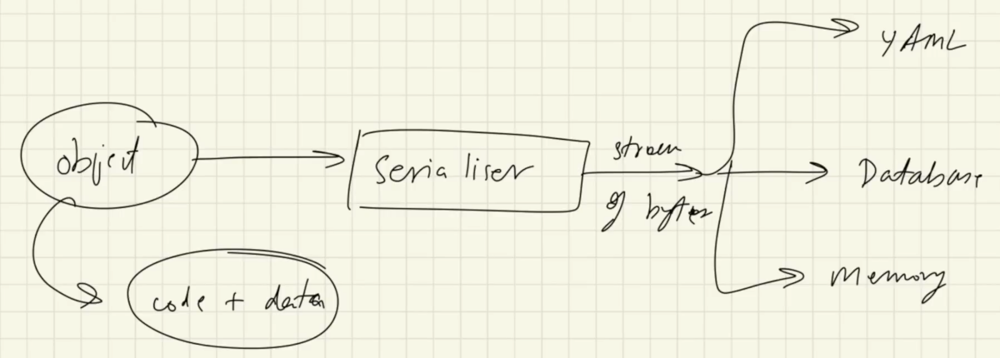

`YAML` : Yet another markup language, YAML ain't markup language  

yaml is a data format to exchange data, similar to XML or JSON  

`YAML` : Yet another markup language, YAML ain't markup language  

yaml is a data format to exchange data, similar to XML or JSON  

in yaml you only store data and not commands  

this thing is know sa Data Serialization  

##### serialization:  
  
and reverse of this is de-serialization.  

Data serialization methods : YAML, XML, JSON  

Yaml used for:  
- configuration file: Docker, Kuberenetes, spring, etc  
- logs, caches

this thing is know sa Data Serialization  

##### serialization:  
  
and reverse of this is de-serialization.  

Data serialization methods : YAML, XML, JSON  

Yaml used for:  
- configuration file: Docker, Kuberenetes, spring, etc  
- logs, caches  

Advantages of yaml:  
1. simple & easy to read & write  
2. can easily convert it into JSON or XML  
3. most ecosystem use it  
4. good to represent complex data  

Strict Nature of yaml:  
1. yaml is case sensetive  
2. yaml is intendation sensetive  

