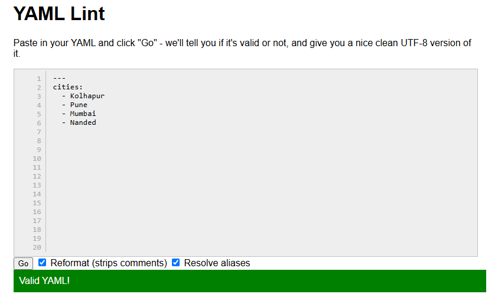
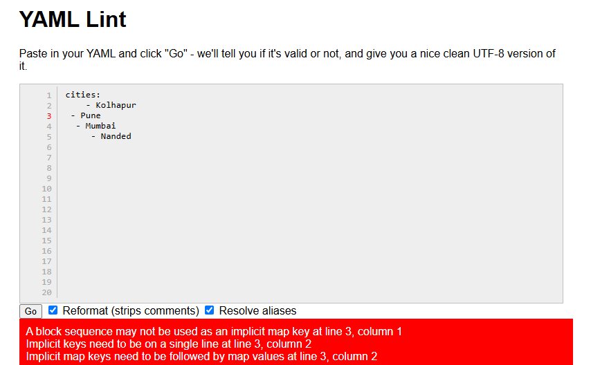

#### Mapping: in yaml we can store data in key value pairs
```yaml
"Bharat" : "im most diverse nation in the world"
"007" : "the name is bond!, James Bond"
```

#### List: in yaml we store list with dash (-)  
```yaml
- apple
- banana
- Apple
- Banana
```  
yaml is case sensitive so
```yaml
- me
- ME
- Me
- mE
```  
are all different words  


#### Block    
```yaml
cities:
    - Kolhapur
    - Pune
    - Mumbai
    - Nanded
```  

but yaml is intendation strict language  
```yaml
cities:
    - Kolhapur
 - Pune
  - Mumbai
     - Nanded
```  
will give us error  
use this url: `https://www.yamllint.com/` to validate the yaml file  
##### Preview:  
  
##### Preview:  
  


