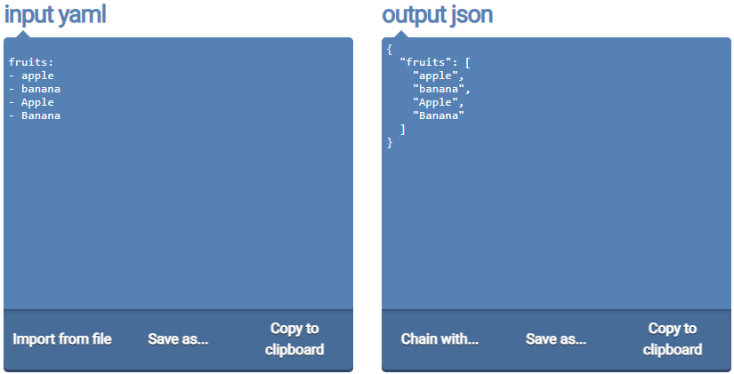
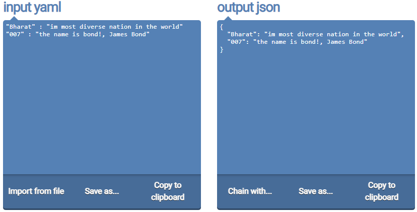

url: `https://onlineyamltools.com/convert-yaml-to-json`  
example 1.   
```yaml
fruits:
- apple
- banana
- Apple
- Banana
```  
##### Preview:  
  
```json
{
  "fruits": [
    "apple",
    "banana",
    "Apple",
    "Banana"
  ]
}
```  
example 2.   
```yaml
"Bharat" : "im most diverse nation in the world"
"007" : "the name is bond!, James Bond"
```  
##### Preview:  
  
```json
{
  "Bharat": "im most diverse nation in the world",
  "007": "the name is bond!, James Bond"
}
```  