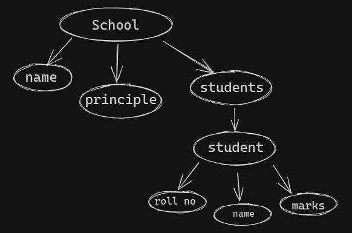
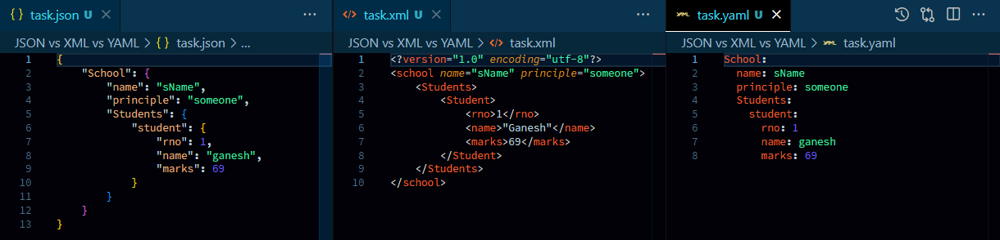

##### data concept:  
  

##### Preview:  
  
#### json:  
```json
{
    "School": {
        "name": "sName",
        "principle": "someone",
        "Students": {
            "student": {
                "rno": 1,
                "name": "ganesh",
                "marks": 69
            }
        }
    }
}
```  
#### xml:  
```xml
<?version="1.0" encoding="utf-8"?>
<school name="sName" principle="someone">
    <Students>
        <Student>
            <rno>1</rno>
            <name>"Ganesh"</name>
            <marks>69</marks>
        </Student>
    </Students>
</school>
```  
#### yaml:  
```yaml
School:
  name: sName
  principle: someone
  Students:
    student:
      rno: 1
      name: ganesh
      marks: 69
```  